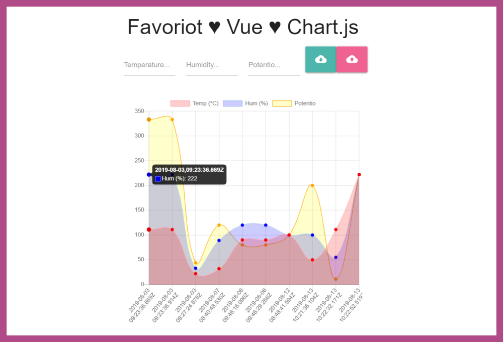

# Favoriot Data Visualization Using Vue & Chart.js


1. Make sure [__*Node.js*__](https://nodejs.org/en/) is installed on your PC, then simply download or clone this repo and install all dependencies:

    ```bash
    $ git clone https://github.com/LintangWisesa/Vue-Chartjs-Favoriot-API.git

    $ cd Vue-Chartjs-Favoriot-API

    $ npm install
    ```

#

2. Open your code editor (I'm using [__*Visual Studio Code*__](https://code.visualstudio.com/)), insert your __*Favoriot API key*__ and __*Favoriot device developer ID*__ to the __components/favoriotChart.vue__ file!
    
    - __*API key*__ goes to request headers:

        ```javascript
        var headers = {
        headers: {
            'Content-Type': 'application/json',
            'apikey': 'your_API_key'
            }
        }
        ```

    - __*Device developer ID*__ goes to request headers:

        ```javascript
        var dataBody = {
          device_developer_id: "your_device_developer_id",
          data: {
            Temperature: this.$refs.temp.value,
            Humidity: this.$refs.hum.value,
            Potentio: this.$refs.pot.value,
          }
        }
        ```
        
#

3. Run the project!

    ```bash
    $ npm run serve
    ```

    The app will be run automatically on http://localhost:8080/. Try to POST some data & GET the data back from Favoriot!

    

    Enjoy your code~ 😍

#

#### Lintang Wisesa :love_letter: _lintangwisesa@ymail.com_

[Facebook](https://www.facebook.com/lintangbagus) | 
[Twitter](https://twitter.com/Lintang_Wisesa) |
[Google+](https://plus.google.com/u/0/+LintangWisesa1) |
[Youtube](https://www.youtube.com/user/lintangbagus) | 
:octocat: [GitHub](https://github.com/LintangWisesa) |
[Hackster](https://www.hackster.io/lintangwisesa)